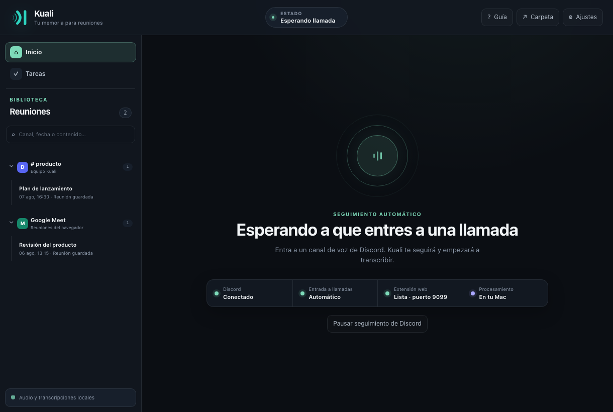

<p align="center">
  
</p>

<h1 align="center">Kuali</h1>

<p align="center">
  <strong>Transcripción local y open source para Discord y Google Meet con atribución real por hablante.</strong>
</p>

<p align="center">
  <a href="https://github.com/igarrux/kuali/actions/workflows/ci.yml"></a>
  <a href="https://github.com/igarrux/kuali/releases/latest"></a>
  
  <a href="LICENSE"></a>
  <a href="browser-extension/LICENSE"></a>
</p>

<p align="center">
  <a href="README.md">English</a> · <strong>Español</strong>
  <br>
  <a href="#funciones">Funciones</a> ·
  <a href="#inicio-rápido">Inicio rápido</a> ·
  <a href="#privacidad">Privacidad</a> ·
  <a href="#desarrollo">Desarrollo</a> ·
  <a href="#comunidad">Comunidad</a> ·
  <a href="https://kuali.garrux.dev/es/">Sitio web</a>
</p>



Kuali escucha llamadas en vivo, las transcribe en tu computadora y conserva
quién dijo cada cosa. Las reuniones se convierten en una biblioteca con
transcripción en vivo, búsqueda, resúmenes, decisiones, preguntas y tareas por
participante.

Whisper y Silero procesan el audio en memoria. Kuali no conserva una grabación
de audio ni la envía a un servicio operado por el proyecto.

## Por qué Kuali

Kuali no comienza con una sola grabación mezclada del sistema. Sus integraciones
con Discord y Google Meet conservan la identidad de la plataforma y el audio
separado cuando está disponible, manteniendo nombres, avatares, fragmentos y
tareas unidos a la persona correcta. La app añade transcripción en vivo,
búsqueda local, resultados estructurados opcionales, entrega cuidada en Discord
y Standard Webhooks firmados sin exigir una cuenta en la nube de Kuali.

El núcleo nativo de escritorio está escrito en Rust. El bot y el gateway de
Discord corren desde tu Mac, mientras que las reuniones del navegador usan una
conexión loopback hacia la misma computadora. Kuali carga Whisper solo cuando
una reunión activa lo necesita y libera el modelo de la RAM al finalizar la
última reunión activa. El proyecto es gratis y open source; no requiere una
suscripción ni una cuenta alojada por Kuali.

Conoce los flujos de
[transcripción de Discord](https://kuali.garrux.dev/es/transcripcion-reuniones-discord/)
y
[transcripción de Google Meet](https://kuali.garrux.dev/es/transcripcion-google-meet/)
en el sitio oficial.

## Funciones

- Transcripción en vivo por hablante para Discord y Google Meet.
- Captura experimental para Microsoft Teams y Zoom, con soporte parcial mientras
  se validan y mejoran sus integraciones.
- Varias reuniones simultáneas con participantes, relojes y estado independientes.
- Núcleo de escritorio nativo en Rust con cerca de 20 MB de memoria observada
  mientras está en espera.
- Ciclo de Whisper bajo demanda: las reuniones activas comparten un modelo y se
  libera de la RAM al finalizar la última.
- Whisper local con aceleración Metal y detección de voz mediante Silero.
- Biblioteca con búsqueda dentro de la transcripción, carpetas por canal y
  exportación Markdown o JSON.
- Resúmenes, puntos clave, decisiones, preguntas y tareas por participante,
  completamente opcionales.
- Filtros de tareas por persona, reunión, estado y rango de fechas.
- Webhooks firmados con la reunión terminada y su transcripción completa.
- Interfaz en español e inglés, configuración guiada, controles en la barra de
  menús e inicio automático.

## Inicio rápido

Instala la versión actual para macOS con Homebrew:

```sh
brew install --cask igarrux/kuali/kuali
xattr -dr com.apple.quarantine /Applications/Kuali.app
```

Para compilar desde el código fuente, instala Rust 1.89+, CMake y un toolchain
de C/C++. Node.js 22+ solo hace falta para desarrollar y probar la extensión.

```sh
git clone https://github.com/igarrux/kuali.git
cd kuali
cargo run -p kuali-app
```

La primera vez, Kuali abre su configuración guiada. Desde ahí puedes crear el
bot de Discord, instalar la extensión y descargar un modelo de Whisper sin
editar archivos de configuración manualmente.

### Discord

Crea un bot en el [Portal de desarrolladores de Discord](https://discord.com/developers/applications),
pega su token y tu `@usuario` en Kuali y elige un servidor en la ventana de
autorización que se abrirá. Kuali obtiene el ID de la aplicación desde el token
y prepara automáticamente los ámbitos y permisos mínimos; no tienes que crear
un enlace de OAuth manualmente.

Kuali puede seguir automáticamente a una cuenta configurada. El seguimiento se
puede pausar sin olvidar la cuenta. Una persona dentro de un canal de voz también
puede invitar al bot mediante `/grabar` o `/record`.

Al entrar, Kuali reproduce y publica el aviso de consentimiento. Lo repite para
quienes llegan después y conserva un registro de auditoría anexado cronológicamente.
Kuali nunca transcribe su propio aviso.

Al terminar una reunión, Kuali puede publicar una tarjeta compacta en Discord
con las tareas, la duración, el número de participantes y accesos privados al
resumen, puntos clave, decisiones, preguntas abiertas y transcripción completa.
El resumen y la transcripción también incluyen archivos de texto descargables,
sin llenar el canal con un bloque enorme. La tarjeta aparece mientras se prepara
el resumen y luego se actualiza en el mismo lugar. Las vistas privadas largas se
paginan dentro de la misma tarjeta, sin repartir la reunión entre varios mensajes.

### Reuniones del navegador

Instala la extensión desde su ficha oficial en
[Chrome Web Store](https://chromewebstore.google.com/detail/kuali/cgojkmdggflcggedmapamcmkelgaahhp)
con Chrome, Edge, Brave o Arc. El código y las instrucciones para cargarla
manualmente durante el desarrollo están en
[`browser-extension/`](browser-extension/README.es.md).

La extensión se comunica únicamente con el receptor local de Kuali. Mantiene
separadas las pistas y la identidad de los participantes cuando el servicio de
reuniones las expone; si recibe audio mezclado, lo etiqueta como tal en lugar de
inventar quién habló.

### Estado de las plataformas

| Plataforma | Estado |
|---|---|
| Discord | Estable |
| Google Meet | Estable |
| Microsoft Teams | Experimental · soporte parcial |
| Zoom | Experimental · soporte parcial |

Teams y Zoom todavía no tienen el mismo nivel de pruebas en reuniones reales
que Discord y Google Meet. La captura, la identidad de participantes o la
separación de hablantes pueden ser incompletas en algunos modos mientras mejora
el soporte.

## Uso de recursos

| Estado | Whisper en RAM | Memoria observada de la app |
|---|---|---:|
| Esperando una reunión | No | Cerca de 20 MB |
| Reunión activa con el modelo Q5 recomendado | Sí | Hasta unos 600 MB |
| Después de finalizar la última reunión activa | No | Regresa hacia el consumo en espera |

Estas cifras son mediciones aproximadas en Apple Silicon; el consumo real varía
según la reunión y el equipo. Las reuniones simultáneas comparten un único
modelo cargado. Los pesos descargados permanecen en disco cuando el modelo se
libera de la RAM.

## Modelos de transcripción

Los pesos se descargan por separado y no vienen dentro de la aplicación. La
ubicación predeterminada es `~/.kuali`, pero se puede cambiar desde Ajustes,
incluido un almacenamiento externo. Kuali verifica la integridad al descargar o
mover los pesos, y cada modelo instalado se puede eliminar individualmente.

| Modelo | Descarga | Recomendado para |
|---|---:|---|
| Base | 148 MB | Transcripción ligera |
| Small | 488 MB | Uso equilibrado de recursos |
| Medium | 1,5 GB | Mayor precisión |
| Large v3 Turbo | 1,6 GB | Alta calidad sin cuantización |
| **Large v3 Turbo Q5** | **574 MB** | **Equilibrio recomendado entre velocidad, precisión y memoria** |
| Large v3 Q5 | 1,1 GB | Mayor precisión con más uso de memoria y latencia |
| Large v3 | 3,1 GB | Máxima precisión; el más lento y con mayor uso de memoria |

## Resúmenes y tareas

Los resúmenes son opcionales. Si desactivas **Ajustes → Resúmenes y tareas**,
Kuali no enviará ninguna transcripción a un LLM. El interruptor bloquea tanto la
generación automática como la manual.

Al activarlo, Kuali puede usar una sesión autenticada de Claude Code, Codex o
Gemini CLI; una clave directa de Anthropic, OpenAI o Gemini; o un endpoint
compatible con OpenAI, como Ollama o LM Studio. Las credenciales se guardan con
permisos `0600` en el archivo de configuración de Kuali.

## Privacidad

| Dato | Tratamiento |
|---|---|
| Audio | Se procesa en memoria; no se guarda como archivo de audio |
| Transcripciones y metadatos | Se guardan localmente en los datos de Kuali |
| Pesos de Whisper | Se guardan en la carpeta elegida por el usuario |
| Solicitudes a LLM | El interruptor **Resúmenes y tareas** las desactiva; si está activo, van únicamente al proveedor configurado |
| Webhooks | Permanecen desactivados hasta crear y habilitar una suscripción |

Las reglas de grabación y consentimiento cambian según el lugar. Kuali ofrece
aviso hablado, aviso escrito y un registro verificable; quien lo opera sigue
siendo responsable de utilizarlos correctamente. Consulta la
[política de privacidad](PRIVACY.es.md).

### Ubicaciones de datos

```text
~/.kuali/                                      Pesos de Whisper y Silero

~/Library/Application Support/com.onwev.Kuali/
└── meetings/<id>/
    ├── meta.json
    └── meeting.json

~/Library/Preferences/com.onwev.Kuali/config.toml
```

**Ajustes → Datos → Restablecer Kuali** elimina la configuración, reuniones,
registros y pesos de Whisper que pertenecen a Kuali después de pedir una frase
de confirmación. Conserva el runtime, Silero, la extensión y cualquier archivo
ajeno dentro de carpetas externas.

## Webhooks

Kuali puede enviar un evento `meeting.completed` para todas las reuniones o
solo para un canal de Discord. El contenido incluye participantes, transcripción
con tiempos, estado del resumen y—si está activado—los puntos clave y tareas.
Las entregas siguen [Standard Webhooks 1.0](https://www.standardwebhooks.com/):
el sobre JSON contiene `type`, `timestamp` y `data`, y cada solicitud incluye
`webhook-id`, `webhook-timestamp` y `webhook-signature`.

Los secretos usan el formato `whsec_`. La firma es un HMAC-SHA256 en Base64
calculado sobre los bytes exactos de
`webhook-id + "." + webhook-timestamp + "." + cuerpo`. Los fallos transitorios
usan el calendario de reintentos recomendado durante varios días, conservando
el identificador de entrega y renovando el timestamp de cada intento.

## Desarrollo

Instala [`just`](https://just.systems/) y [`fzf`](https://junegunn.github.io/fzf/)
para usar el menú de comandos versionado con el proyecto:

```sh
brew install just fzf
just
```

Elige una receta y presiona Enter, o ejecuta una directamente; por ejemplo,
`just dev`, `just test` o `just check`. Usa `just --list` para consultar todas
las recetas y sus descripciones. Los comandos subyacentes siguen siendo:

```sh
cargo fmt --all --check
cargo clippy --workspace --all-targets -- -D warnings
cargo test --workspace
(cd browser-extension && npm test)
node --test src/i18n.test.mjs
```

La prueba E2E interactiva de Google Meet abre una reunión real y verifica el
protocolo de captura, la atribución, la transcripción en vivo, el cierre y la
liberación del modelo:

```sh
cd browser-extension
npm run test:e2e:meet
```

### Estructura

| Ruta | Responsabilidad |
|---|---|
| `crates/kuali-core` | Tipos compartidos y configuración |
| `crates/kuali-discord` | Discord, consentimiento y audio por hablante |
| `crates/kuali-meet` | Receptor local y protocolo de reuniones del navegador |
| `crates/kuali-stt` | Segmentación, Silero, Whisper y almacenamiento de modelos |
| `crates/kuali-llm` | Proveedores y resultados estructurados |
| `crates/kuali-store` | Persistencia, búsqueda y exportación |
| `crates/kuali-engine` | Coordinación de reuniones simultáneas |
| `src-tauri` / `src` | Backend de escritorio e interfaz bilingüe |
| `browser-extension` | Extensión de captura para el navegador |

## Comunidad

Kuali se construye públicamente y las contribuciones son bienvenidas:

- Consulta el [roadmap](ROADMAP.md) para conocer las áreas activas.
- Elige un issue marcado como
  [`good first issue`](https://github.com/igarrux/kuali/labels/good%20first%20issue)
  o [`help wanted`](https://github.com/igarrux/kuali/labels/help%20wanted).
- Haz preguntas y propón cambios amplios en
  [GitHub Discussions](https://github.com/igarrux/kuali/discussions).
- Sigue [CONTRIBUTING.md](CONTRIBUTING.md) para preparar el entorno, comprender
  la arquitectura, ejecutar pruebas y abrir el PR contra `sandbox`.
- Usa el canal privado indicado en [SECURITY.md](SECURITY.md) para problemas de
  seguridad o exposición accidental de datos sensibles.

Los reportes reproducibles, pruebas controladas de plataformas, documentación,
traducciones, accesibilidad y cambios de código enfocados son valiosos.

## Licencia

El escritorio está disponible bajo la [licencia MIT](LICENSE). La extensión se
distribuye por separado bajo la
[licencia Apache 2.0](browser-extension/LICENSE); los avisos de terceros están
en [`browser-extension/NOTICE`](browser-extension/NOTICE).
