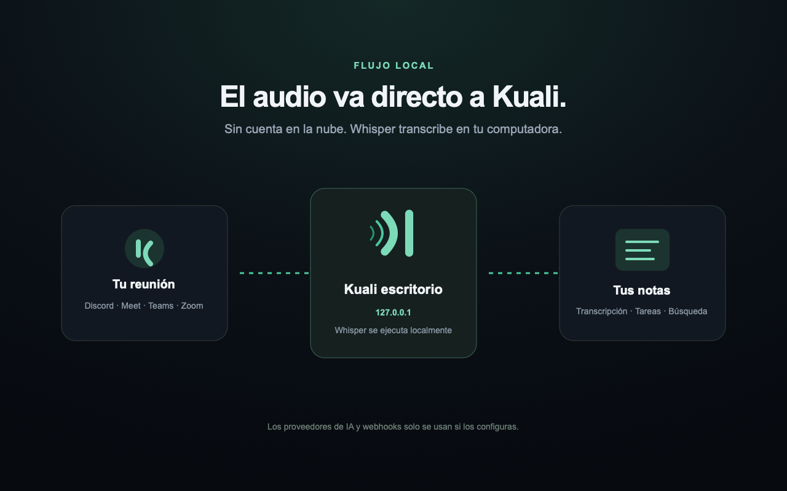

<p align="center">
  
</p>

<h1 align="center">Kuali</h1>

<p align="center">
  <strong>Transcripción privada y local de reuniones con atribución real por hablante.</strong>
</p>

<p align="center">
  <a href="https://github.com/igarrux/kuali/actions/workflows/ci.yml"></a>
  <a href="LICENSE"></a>
  <a href="browser-extension/LICENSE"></a>
</p>

<p align="center">
  <a href="README.md">English</a> · <strong>Español</strong>
  <br>
  <a href="#funciones">Funciones</a> ·
  <a href="#inicio-rápido">Inicio rápido</a> ·
  <a href="#privacidad">Privacidad</a> ·
  <a href="#desarrollo">Desarrollo</a>
</p>



Kuali escucha llamadas en vivo, las transcribe en tu computadora y conserva
quién dijo cada cosa. Las reuniones se convierten en una biblioteca con
transcripción en vivo, búsqueda, resúmenes, decisiones, preguntas y tareas por
participante.

Whisper y Silero procesan el audio en memoria. Kuali no conserva una grabación
de audio ni la envía a un servicio operado por el proyecto.

## Funciones

- Transcripción en vivo por hablante para Discord y reuniones del navegador.
- Varias reuniones simultáneas con participantes, relojes y estado independientes.
- Whisper local con aceleración Metal y detección de voz mediante Silero.
- Biblioteca con búsqueda dentro de la transcripción, carpetas por canal y
  exportación Markdown o JSON.
- Resúmenes, puntos clave, decisiones, preguntas y tareas por participante,
  completamente opcionales.
- Filtros de tareas por persona, reunión, estado y rango de fechas.
- Webhooks firmados con la reunión terminada y su transcripción completa.
- Interfaz en español e inglés, configuración guiada, controles en la barra de
  menús e inicio automático.

## Inicio rápido

La compilación actual requiere macOS 11 o posterior en Apple Silicon, Rust
1.89+, CMake y un toolchain de C/C++. Node.js 22+ solo hace falta para desarrollar
y probar la extensión.

```sh
git clone https://github.com/igarrux/kuali.git
cd kuali
cargo run -p kuali-app
```

La primera vez, Kuali abre su configuración guiada. Desde ahí puedes crear el
bot de Discord, instalar la extensión y descargar un modelo de Whisper sin
editar archivos de configuración manualmente.

### Discord

Crea un bot en el [Portal de desarrolladores de Discord](https://discord.com/developers/applications),
pega su token en Kuali e instálalo en los servidores donde se usará. La guía de
la aplicación muestra cada pantalla y los permisos exactos.

Kuali puede seguir automáticamente a una cuenta configurada. El seguimiento se
puede pausar sin olvidar la cuenta. Una persona dentro de un canal de voz también
puede invitar al bot mediante `/grabar` o `/record`.

Al entrar, Kuali reproduce y publica el aviso de consentimiento. Lo repite para
quienes llegan después y conserva un registro de auditoría anexado cronológicamente.
Kuali nunca transcribe su propio aviso.

### Reuniones del navegador

La extensión está en [`browser-extension/`](browser-extension/README.es.md).
Hasta que exista una publicación en la tienda, abre la página de extensiones de
Chrome, Edge, Brave o Arc, activa el modo desarrollador y carga esa carpeta como
extensión descomprimida. La guía de Kuali explica el proceso paso a paso.

La extensión se comunica únicamente con el receptor local de Kuali. Mantiene
separadas las pistas y la identidad de los participantes cuando el servicio de
reuniones las expone; si recibe audio mezclado, lo etiqueta como tal en lugar de
inventar quién habló.

## Modelos de transcripción

Los pesos se descargan por separado y no vienen dentro de la aplicación. La
ubicación predeterminada es `~/.kuali`, pero se puede cambiar desde Ajustes,
incluido un almacenamiento externo. Kuali verifica la integridad al descargar o
mover los pesos, y cada modelo instalado se puede eliminar individualmente.

| Modelo | Descarga | Recomendado para |
|---|---:|---|
| Tiny | 78 MB | Comprobar la instalación rápidamente |
| Base | 148 MB | Transcripción ligera |
| Small | 488 MB | Uso equilibrado de recursos |
| Medium | 1,5 GB | Mayor precisión |
| Large v3 Turbo | 1,6 GB | Máxima calidad multilingüe |
| **Large v3 Turbo Q5** | **574 MB** | **Equilibrio recomendado** |
| Large v3 Turbo LatAm | 1,6 GB | Español latinoamericano |
| Large v3 Turbo LatAm Q5 | 574 MB | Alternativa LatAm más ligera |

## Resúmenes y tareas

Los resúmenes son opcionales. Si desactivas **Ajustes → Resúmenes y tareas**,
Kuali no enviará ninguna transcripción a un LLM. El interruptor bloquea tanto la
generación automática como la manual.

Al activarlo, Kuali puede usar una sesión autenticada de Claude Code, Codex o
Gemini CLI; una clave directa de Anthropic, OpenAI o Gemini; o un endpoint
compatible con OpenAI, como Ollama o LM Studio. Las credenciales se guardan con
permisos `0600` en el archivo de configuración de Kuali.

## Privacidad

| Dato | Tratamiento |
|---|---|
| Audio | Se procesa en memoria; no se guarda como archivo de audio |
| Transcripciones y metadatos | Se guardan localmente en los datos de Kuali |
| Pesos de Whisper | Se guardan en la carpeta elegida por el usuario |
| Solicitudes a LLM | El interruptor **Resúmenes y tareas** las desactiva; si está activo, van únicamente al proveedor configurado |
| Webhooks | Permanecen desactivados hasta crear y habilitar una suscripción |

Las reglas de grabación y consentimiento cambian según el lugar. Kuali ofrece
aviso hablado, aviso escrito y un registro verificable; quien lo opera sigue
siendo responsable de utilizarlos correctamente. Consulta la
[política de privacidad](PRIVACY.es.md).

### Ubicaciones de datos

```text
~/.kuali/                                      Pesos de Whisper y Silero

~/Library/Application Support/com.onwev.Kuali/
└── meetings/<id>/
    ├── meta.json
    └── meeting.json

~/Library/Preferences/com.onwev.Kuali/config.toml
```

**Ajustes → Datos → Restablecer Kuali** elimina la configuración, reuniones,
registros y pesos de Whisper que pertenecen a Kuali después de pedir una frase
de confirmación. Conserva el runtime, Silero, la extensión y cualquier archivo
ajeno dentro de carpetas externas.

## Webhooks

Kuali puede enviar un evento `meeting.completed` para todas las reuniones o
solo para un canal de Discord. El contenido incluye participantes, transcripción
con tiempos, estado del resumen y—si está activado—los puntos clave y tareas.
Las solicitudes se firman con HMAC-SHA256 y solo se reintentan ante fallos
transitorios.

La firma se calcula en hexadecimal minúsculo sobre los bytes exactos de
`timestamp + "." + cuerpo`, usando el secreto de la suscripción. Cada petición
incluye `X-Kuali-Event`, `X-Kuali-Delivery`, `X-Kuali-Timestamp`,
`X-Kuali-Attempt` y `X-Kuali-Signature`.

## Desarrollo

```sh
cargo fmt --all --check
cargo clippy --workspace --all-targets -- -D warnings
cargo test --workspace
(cd browser-extension && npm test)
node --test src/i18n.test.mjs
```

La prueba E2E interactiva de Google Meet abre una reunión real y verifica el
protocolo de captura, la atribución, la transcripción en vivo, el cierre y la
liberación del modelo:

```sh
cd browser-extension
npm run test:e2e:meet
```

### Estructura

| Ruta | Responsabilidad |
|---|---|
| `crates/kuali-core` | Tipos compartidos y configuración |
| `crates/kuali-discord` | Discord, consentimiento y audio por hablante |
| `crates/kuali-meet` | Receptor local y protocolo de reuniones del navegador |
| `crates/kuali-stt` | Segmentación, Silero, Whisper y almacenamiento de modelos |
| `crates/kuali-llm` | Proveedores y resultados estructurados |
| `crates/kuali-store` | Persistencia, búsqueda y exportación |
| `crates/kuali-engine` | Coordinación de reuniones simultáneas |
| `src-tauri` / `src` | Backend de escritorio e interfaz bilingüe |
| `browser-extension` | Extensión de captura para el navegador |

Las contribuciones son bienvenidas. Lee [CONTRIBUTING.md](CONTRIBUTING.md) antes
de abrir un pull request y reporta problemas de seguridad mediante el canal
privado indicado en [SECURITY.md](SECURITY.md).

## Licencia

El escritorio está disponible bajo la [licencia MIT](LICENSE). La extensión se
distribuye por separado bajo la
[licencia Apache 2.0](browser-extension/LICENSE); los avisos de terceros están
en [`browser-extension/NOTICE`](browser-extension/NOTICE).
