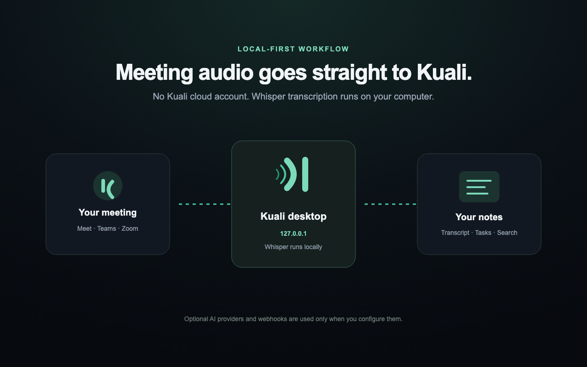

<p align="center">
  
</p>

<h1 align="center">Kuali</h1>

<p align="center">
  <strong>Private, local-first meeting transcription with real speaker attribution.</strong>
</p>

<p align="center">
  <a href="https://github.com/igarrux/kuali/actions/workflows/ci.yml"></a>
  <a href="LICENSE"></a>
  <a href="browser-extension/LICENSE"></a>
</p>

<p align="center">
  <strong>English</strong> · <a href="README.es.md">Español</a>
  <br>
  <a href="#features">Features</a> ·
  <a href="#quick-start">Quick start</a> ·
  <a href="#privacy">Privacy</a> ·
  <a href="#development">Development</a>
</p>



Kuali listens to live calls, transcribes them on your computer, and keeps every
speaker attached to their words. Meetings become a searchable library with live
transcripts, summaries, decisions, questions, and participant-owned tasks.

Raw audio is processed in memory by Whisper and Silero. It is never retained as
an audio recording and never sent to a Kuali-operated service.

## Features

- Live, speaker-attributed transcription for Discord and Google Meet.
- Experimental browser capture for Microsoft Teams and Zoom, with partial
  support while their integrations are validated and improved.
- Separate concurrent meetings without shared participants, clocks, or state.
- Local Whisper inference with Metal acceleration and Silero voice detection.
- Searchable meeting library with transcript excerpts, channel folders, and
  Markdown or JSON export.
- Optional summaries, key points, decisions, questions, and tasks by participant.
- Task filters by person, meeting, status, and date range.
- Signed webhooks containing the completed meeting and full transcript.
- English and Spanish interface, guided setup, menu-bar controls, and launch at
  login.

## Quick start

Install the current macOS release with Homebrew:

```sh
brew install --cask igarrux/kuali/kuali
xattr -dr com.apple.quarantine /Applications/Kuali.app
```

To build from source, install Rust 1.89+, CMake, and a C/C++ toolchain. Node.js
22+ is needed only for extension development and tests.

```sh
git clone https://github.com/igarrux/kuali.git
cd kuali
cargo run -p kuali-app
```

Kuali opens its guided setup on first launch. The guide walks through creating
the Discord bot, installing the browser extension, and downloading a Whisper
model without requiring manual configuration-file edits.

### Discord

Create a bot in the [Discord Developer Portal](https://discord.com/developers/applications),
copy its token and your `@username` into Kuali, then choose a server in the
Discord authorization window Kuali opens. Kuali derives the application ID
from the token and prepares the required scopes and minimum permissions
automatically; you do not need to configure an OAuth link by hand.

Kuali can follow one configured Discord account automatically. Automatic
following can be paused at any time without forgetting the account. A person in
a voice channel can also invite the bot with `/grabar` or `/record`.

When Kuali joins, it plays and posts the consent notice. It repeats the notice
for participants who arrive later and keeps an append-only consent audit log.
Kuali never captures its own announcement.

After a meeting, Kuali can publish a compact Discord card with its action items,
duration, participant count, and private buttons for the complete summary and
transcript. Each private view includes a downloadable text file, keeping the
channel readable without hiding the full meeting record. The card appears while
the summary is being prepared, then updates in place; private views render every
section and transcript turn in Discord as well as offering the download.

### Browser meetings

Install the extension from its official
[Chrome Web Store listing](https://chromewebstore.google.com/detail/kuali/cgojkmdggflcggedmapamcmkelgaahhp)
in Chrome, Edge, Brave, or Arc. Its source and unpacked development instructions
live in [`browser-extension/`](browser-extension/README.md).

The extension connects only to Kuali's loopback listener. It preserves separate
speaker tracks and participant identity when the meeting service exposes them,
and labels mixed audio honestly instead of inventing an attribution.

### Platform support

| Platform | Status |
|---|---|
| Discord | Stable |
| Google Meet | Stable |
| Microsoft Teams | Experimental · partial support |
| Zoom | Experimental · partial support |

Teams and Zoom have not yet received the same depth of real-world testing as
Discord and Google Meet. Their capture, participant identity, or speaker
separation may be incomplete in some meeting modes while support improves.

## Transcription models

Model weights are downloaded separately and are not embedded in the app. The
default directory is `~/.kuali`; it can be changed from Settings, including to
external storage. Kuali verifies model integrity when weights are downloaded or
moved, and each installed weight can be removed individually.

| Model | Download | Best for |
|---|---:|---|
| Tiny | 78 MB | Fast setup checks |
| Base | 148 MB | Lightweight transcription |
| Small | 488 MB | Balanced resource use |
| Medium | 1.5 GB | Higher accuracy |
| Large v3 Turbo | 1.6 GB | Maximum multilingual quality |
| **Large v3 Turbo Q5** | **574 MB** | **Recommended balance** |
| Large v3 Turbo LatAm | 1.6 GB | Latin American Spanish |
| Large v3 Turbo LatAm Q5 | 574 MB | Lighter LatAm option |

## Summaries and tasks

Summaries are optional. Turn off **Settings → Summaries and tasks** and Kuali
will not send any transcript to an LLM. The switch blocks both automatic and
manual summary generation.

When enabled, Kuali can use an authenticated Claude Code, Codex, or Gemini CLI;
a direct Anthropic, OpenAI, or Gemini API key; or an OpenAI-compatible endpoint
such as Ollama or LM Studio. Provider credentials are stored with `0600`
permissions in Kuali's configuration file.

## Privacy

| Data | Handling |
|---|---|
| Raw audio | Processed in memory; not saved as an audio file |
| Transcripts and meeting metadata | Stored locally in Kuali's application-data directory |
| Whisper model weights | Stored in the directory selected by the user |
| LLM requests | Disabled by the **Summaries and tasks** switch; otherwise sent only to the configured provider |
| Webhooks | Disabled until the user creates and enables a subscription |

Recording and consent requirements vary by location. Kuali provides audible,
written, and logged disclosure mechanisms, but the person operating it remains
responsible for using them appropriately. See the full [privacy policy](PRIVACY.md).

### Data locations

```text
~/.kuali/                                      Whisper and Silero weights

~/Library/Application Support/com.onwev.Kuali/
└── meetings/<id>/
    ├── meta.json
    └── meeting.json

~/Library/Preferences/com.onwev.Kuali/config.toml
```

**Settings → Data → Reset Kuali** removes Kuali-owned configuration, meetings,
logs, and Whisper weights after typed confirmation. It preserves the bundled
runtime, Silero, the browser extension, and unrelated files in external model
directories.

## Integrations

Kuali can deliver a `meeting.completed` webhook for every meeting or for one
specific Discord channel. The payload contains participants, the timestamped
transcript, summary status, and—when enabled—the generated insights and tasks.
Deliveries follow [Standard Webhooks 1.0](https://www.standardwebhooks.com/):
the JSON envelope contains `type`, `timestamp`, and `data`, while each request
includes `webhook-id`, `webhook-timestamp`, and `webhook-signature`.

Endpoint secrets use the `whsec_` format. Verify the Base64 HMAC-SHA256
signature over the exact bytes of
`webhook-id + "." + webhook-timestamp + "." + body`. Transient failures use the
recommended multi-day retry schedule while preserving the delivery ID and
refreshing the attempt timestamp.

## Development

Install [`just`](https://just.systems/) and [`fzf`](https://junegunn.github.io/fzf/)
to use the versioned project command menu:

```sh
brew install just fzf
just
```

Choose a recipe and press Enter, or run one directly—for example,
`just dev`, `just test`, or `just check`. Use `just --list` to inspect every
available recipe and its description. The underlying commands remain:

```sh
cargo fmt --all --check
cargo clippy --workspace --all-targets -- -D warnings
cargo test --workspace
(cd browser-extension && npm test)
node --test src/i18n.test.mjs
```

The interactive Google Meet end-to-end test opens a real meeting and verifies
the capture wire, speaker attribution, live Whisper output, clean shutdown, and
model unload:

```sh
cd browser-extension
npm run test:e2e:meet
```

### Project structure

| Path | Responsibility |
|---|---|
| `crates/kuali-core` | Shared types and configuration |
| `crates/kuali-discord` | Discord lifecycle, consent, and per-speaker audio |
| `crates/kuali-meet` | Local browser-meeting ingest and wire protocol |
| `crates/kuali-stt` | Segmentation, Silero VAD, Whisper, and model storage |
| `crates/kuali-llm` | LLM providers and structured meeting insights |
| `crates/kuali-store` | Persistence, search, and export |
| `crates/kuali-engine` | Concurrent meeting orchestration |
| `src-tauri` / `src` | Desktop backend and bilingual interface |
| `browser-extension` | Browser capture extension |

Contributions are welcome. Read [CONTRIBUTING.md](CONTRIBUTING.md) before
opening a pull request, and report security issues through
[GitHub private vulnerability reporting](SECURITY.md).

## License

The desktop workspace is available under the [MIT License](LICENSE). The
browser extension is distributed separately under the
[Apache License 2.0](browser-extension/LICENSE); third-party notices are in
[`browser-extension/NOTICE`](browser-extension/NOTICE).
